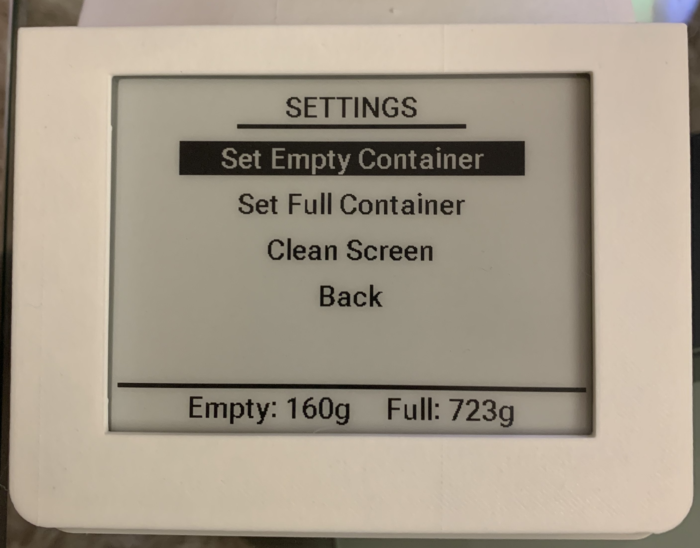
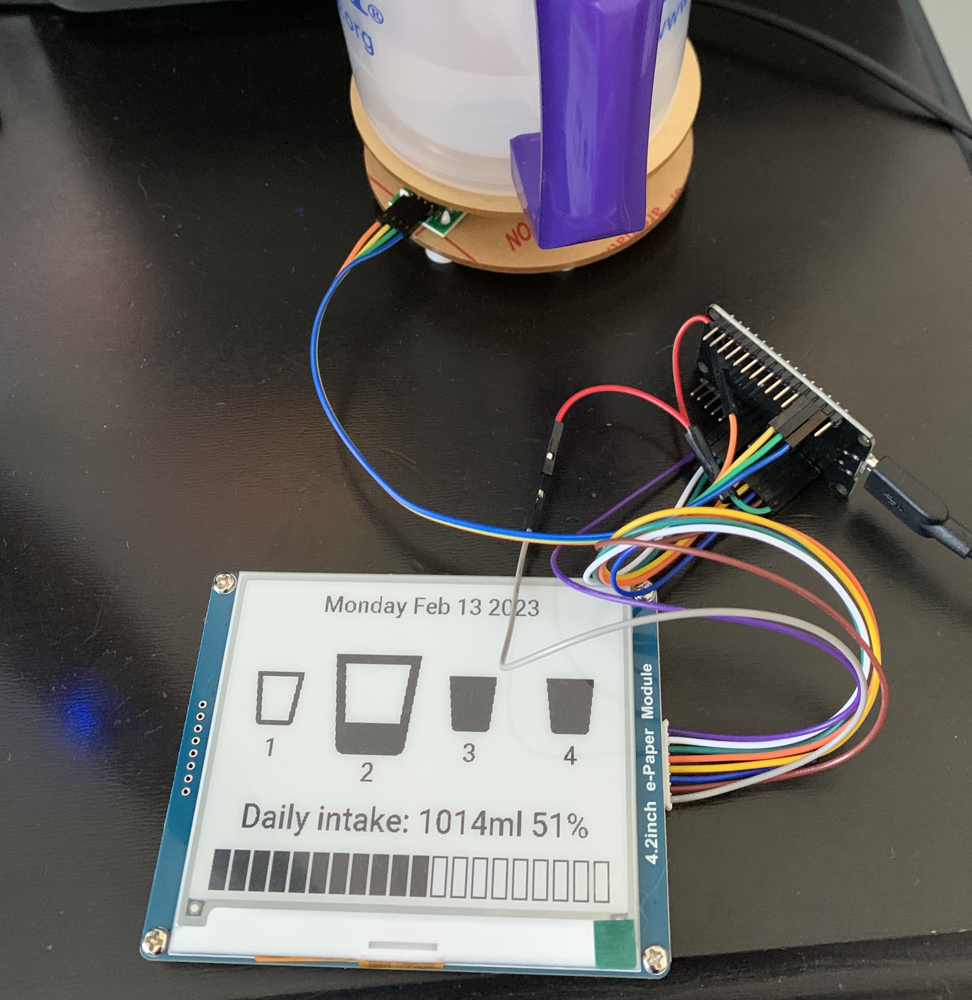
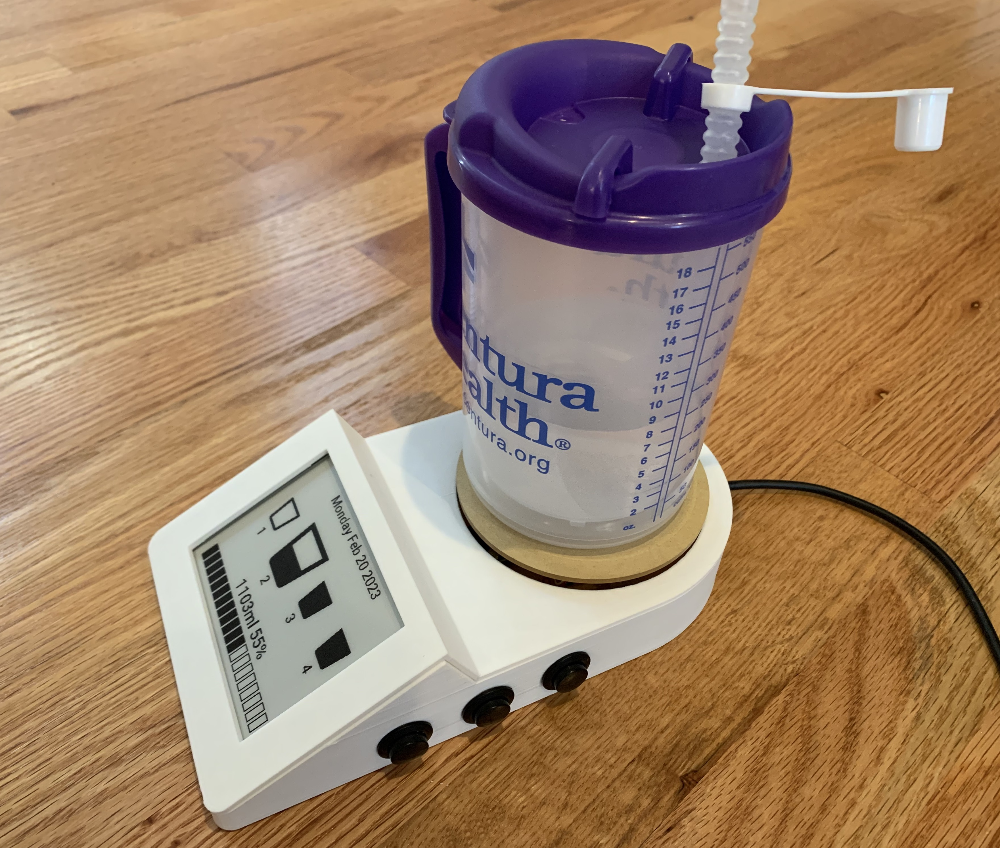
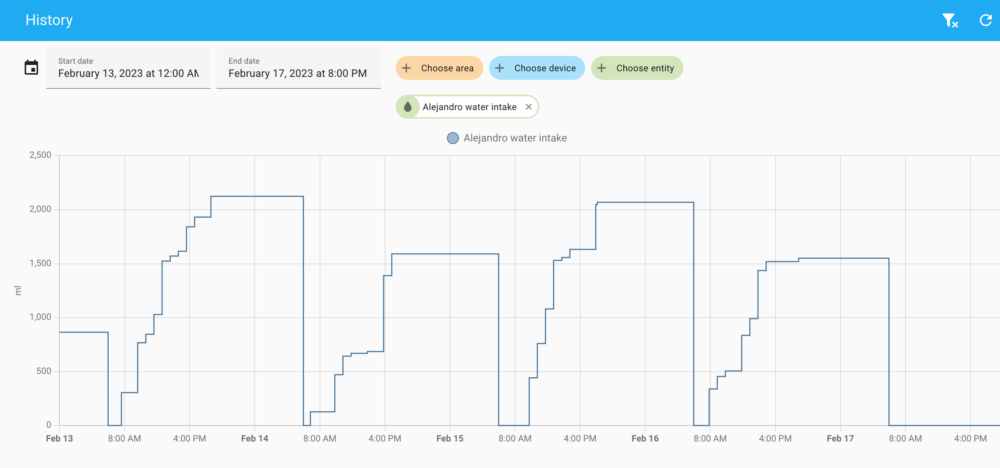

# esphome-water-intake

An ESPhome based scale to track your daily water intake. It measures the weight of a water container (cup, bottle, glass, etc.) and the water you drink. 


## Why?

I have a history of kidney stones, so need a motivation to drink more water.

## Usage

Just place the container in the scale while you drink over your day. It makes some assumptions though:
* If the container has more water than before, it assumes you refilled it. The remaining water before the refill is not accounted to your daily intake.
* Once refilled, if the container is not full, it assumes you drank the difference. So, always refill it to the top.
* You can manually adjust the water intake in increments of 100ml pressing the "up" and "down" buttons.
* The daily intake is reset at midnight. And the ESP32 goes to sleep until 6am.

## Setup

Press the "settings" button to enter the SETTINGS menu. Scroll (with the up/down) to navigate the options and press "settings" again to select it:
* "Set Empty Container": place an empty container in the scale to set its empty weight
* "Set Full Container": place the container full of water in the scale to set its full weight

By default it assumes the daily water intake goal is 2 liters. You can change it in the .yaml file.


## Build

List of Material:
* A ESP32 dev board, like this one [ESP32 ESP-WROOM-32](https://www.amazon.com/gp/product/B08246MCL5/ref=ppx_yo_dt_b_search_asin_title?ie=UTF8&psc=1)
* For the scale, a Digital Load Cell Weight Sensor HX711. I've used this [one](https://www.amazon.com/gp/product/B07GQPV6C4/ref=ppx_yo_dt_b_search_asin_title?ie=UTF8&th=1).
* For the display, I've use the [Waveshare 4.2inch E-Ink Display](https://www.amazon.com/gp/product/B074NR1SW2/ref=ppx_yo_dt_b_search_asin_title?ie=UTF8&psc=1)
* For the buttons, 3 of [these](https://www.amazon.com/gp/product/B09V2M74CQ/ref=ppx_yo_dt_b_search_asin_title?ie=UTF8&psc=1) push buttons
* For the case:
  * [Blender](https://www.blender.org) software to design the case. Load the [water_scale.blend](water_scale.blend)
  * A 3D printer to print it.




## Home Assistant

Every hour the daily intake is sent to Home Assistant for tracking over time. Change the sensore name in the .yaml for your use case:
```
sensor:
  - platform: template
    name: "Alejandro water intake"
    device_class: "water"
```
